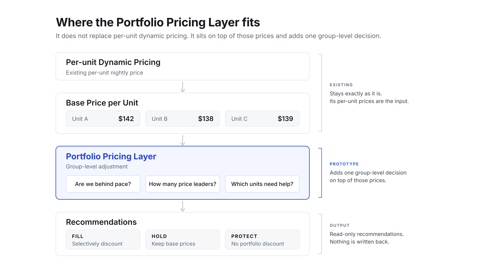

# Portfolio Pricing Layer

[](https://github.com/mateusgetulio/portfolio-pricing-layer/actions/workflows/ci.yml)

An unofficial prototype of a read-only portfolio pricing layer for hosts who run several comparable short-term rental units, built with Laravel 13 and Pest. It is not affiliated with any property management vendor and uses no vendor data.

## The problem

Twelve interchangeable apartments, eight booked for Saturday, four still empty. A pricing engine that prices each listing on its own can discount all four, and then they compete with each other for the same guests. This layer adds one group-level decision on top of each unit's existing dynamic price: how far the group is from its pace target, how many units should lead on price, which ones, and by how much, with a plain-language reason for every night.

It recommends prices and never writes them. The per-unit dynamic price is an input and is never changed.



## Run it

You need PHP 8.4 or newer and Composer. There is no database and no Node toolchain.

```bash
composer setup
php artisan serve
```

Open http://127.0.0.1:8000/demo, move the booked units and lead time sliders, and select a unit to read its reason.

The same pricing runs from the command line against the fixture in `fixtures/twelve-apartments.json`:

```bash
php artisan pricing:recommend --date=2026-09-19
```

It prints a headline such as `Downtown 1BR, Saturday 2026-09-19: 8 of 12 booked, target 10 by 8 days out. Behind pace, 2 price leaders at up to 8%.`, followed by every unit's base price, recommended price, discount and reason. Leave out `--date` to price every night in the fixture.

Checks, the same ones CI runs on PHP 8.4 and 8.5:

```bash
vendor/bin/pest
vendor/bin/pint --test
vendor/bin/phpstan analyse
```

## The worked example

Group "Downtown 1BR", Saturday, 8 days out, 8 of 12 units booked:

1. The weekend pace target at 8 days sits between 7 days (0.85) and 14 days (0.70): **0.83**.
2. Target booked units: ceil(0.83 × 12) = 10, so the **leader budget is 2**.
3. Occupancy 0.67 is 0.16 behind the target, more than the 0.05 fill margin: **behind pace**.
4. Group discount rate: 0.02 + 0.25 × 0.16 + 0.05 × (14 - 8) / 14 = 0.082, rounded to **8%**.
5. The weakest unit gets 8%, the next one 8% × 0.75 = **6%**. The other two available units are held.

| Unit | Base | Trailing occupancy | Booking strength | Decision | Recommended |
|---|---|---|---|---|---|
| Apartment 9 | $142 | 0.85 | 1.18 | Held | $142 |
| Apartment 10 | $140 | 0.76 | 1.06 | Held | $140 |
| Apartment 11 | $138 | 0.60 | 0.83 | Price leader 2, -6% | $130 |
| Apartment 12 | $139 | 0.51 | 0.71 | Price leader 1, -8% | $128 |

The same group at other booking levels, 8 days out, is the slider sequence on the demo page:

| Booked | Mode | Price leaders | Discounts |
|---|---|---|---|
| 3 of 12 | Behind pace | 7 | 15% (the cap), 11%, 8%, 6%, 5%, 4%, 3% |
| 8 of 12 | Behind pace | 2 | 8%, 6% |
| 10 of 12 | On pace | 0 | none |
| 11 of 12 | Ahead of pace | 0 | none |

Recommended prices round up to a whole dollar so rounding never gives more discount than was assigned. That is why the capped 15% shows as 14% on Apartment 12: $139 × 0.85 = $118.15, rounded up to $119.

## Invariants

Ten rules run as Pest tests over 2,000 seeded random portfolios with different group sizes, booking levels, lead times, missing nights, prices with cents, floors that bind and numeric unit IDs. Each invariant is its own test, and a failure lists every violation in that portfolio, not just the first.

| ID | Invariant |
|---|---|
| INV-1 | Booked and blocked nights are never changed. |
| INV-2 | Every available night stays within its unit's floor and ceiling. |
| INV-3 | No discount and no price leader unless the group is behind pace. |
| INV-4 | Never more price leaders than the leader budget. |
| INV-5 | Within a group and night, a stronger unit never gets a larger assigned discount than a weaker one. Measured on assigned discounts, because clamps and whole-dollar rounding move the effective discount. |
| INV-6 | No price goes above its base price unless the base is already below the host's floor, no discount exceeds `max_discount`, and rounding never gives more discount than assigned. Random portfolios never put a base price below its floor. |
| INV-7 | Groups smaller than `min_group_size` pass through unchanged. |
| INV-8 | Deterministic and pure: the same snapshot gives the same recommendations, the input is never mutated, and the order of units does not matter. |
| INV-9 | Every night has a reason naming the rule that fits its status and mode. |
| INV-10 | Booking one more unit never increases the leader budget, the group discount rate or the total assigned discount, and never moves the group toward discounting. One unit's discount can still rise when a weaker unit books, because it becomes the leader. |

A failing run names its seed and the command to replay it, for example:

```
INV-5 failed for random portfolio seed 1234. Rerun it with PRICING_TEST_SEED=1234 vendor/bin/pest --filter='INV-5\b'
```

Fixed scenarios cover the worked example, each mode, a fully booked group, blocked units, heterogeneous base prices, binding floors, a group of two, a unit with no history and tied strengths. Input validation is tested case by case: floor above ceiling, prices that are not positive, duplicate or unknown IDs, occupancy outside 0 to 1, unknown night statuses, malformed dates, malformed pace curves and thresholds out of range.

## What I would validate before shipping

1. **Does this stack on top of the per-unit engine's own gap or availability adjustments?** Dynamic pricing often already lowers prices for harder-to-fill gaps. If empty nights are already discounted in the base price, a portfolio discount could double-count. The layer might need a pre-adjustment price, or to size its discount against the adjustment already applied.
2. **Do comparable units actually substitute for one another?** If guests do not treat these listings as interchangeable, portfolio pricing is the wrong abstraction for that group. Check cross-unit booking behavior before trusting a group definition.
3. **Does booking strength predict relative conversion?** Trailing occupancy is intentionally crude. With real data, test conversion rate, impressions, average daily rate (ADR), amenities and listing quality.
4. **What should the pace curve be?** Fit it from historical booking curves per market or property cohort instead of synthetic values.
5. **Does selective discounting beat uniform discounting and today's pricing?** Run an experiment against the existing pricing policy, not an invented baseline. Units in the same group affect each other's bookings, so randomize by group or by host, never by unit.
6. **Which guardrails matter commercially?** Group revenue per available night (RevPAN), ADR, occupancy, average discount given, cancellations, and how often hosts override the recommendation. Occupancy alone is not success.

## How it decides

For each group and night. Booked and blocked nights are never touched.

1. **Small groups pass through.** Groups smaller than `min_group_size` keep their base prices, clamped to floor and ceiling.
2. **Occupancy and target.** Occupancy O is booked units over sellable units (blocked units are excluded). The target T comes from the pace curve for the night's lead time and day type.
3. **Leader budget.** `clamp(ceil(T × sellable) - booked, 0, available)`. One price leader per missing booking is a stated simplification, not a claim that each discount produces a booking.
4. **Mode, relative to the target.** Ahead of pace when O ≥ T + `protect_margin`. Behind pace when T - O ≥ `fill_margin` and the leader budget is at least 1. On pace otherwise. Only a group behind pace gets discounts.
5. **Group discount rate.** `min(max_discount, base_step + shortfall_weight × (T - O) + urgency_weight × urgency)`, rounded to a whole percent, where urgency grows from 0 to 1 over the last `urgency_window_days` before the night.
6. **Price leaders.** Available units ranked by booking strength, weakest first, ties broken by unit ID. Booking strength is a unit's trailing occupancy divided by the group's mean, over units with at least `min_history_nights` of history. Newer units count as exactly average, so missing data never makes a unit the first to be discounted.
7. **Each leader's discount.** `g × (1 - leader_taper)^rank`, rounded to a whole percent and never above the previous leader's. The list ends at the first discount that rounds to 0%.
8. **Price.** The discounted price rounds up to a whole currency unit, never above the base price, then is clamped to the host's floor and ceiling.
9. **Reason.** Every night gets one. The percentage is taken from the final price, and a floor or ceiling clamp is named.

## Configuration

Every threshold lives in `config/portfolio_pricing.php` and becomes a validated `PricingConfig` value object at the edge of the application.

| Key | Default | Meaning |
|---|---|---|
| `min_group_size` | 3 | Smaller groups pass through unchanged |
| `protect_margin` | 0.05 | How far ahead of target a group must be before prices are protected |
| `fill_margin` | 0.05 | How far behind target a group must be before leaders are discounted |
| `budget_rounding` | `ceil` | How target booked units are rounded, `ceil` or `round` |
| `urgency_window_days` | 14 | Lead time at which urgency starts adding discount |
| `base_step` | 0.02 | Starting group discount |
| `shortfall_weight` | 0.25 | Discount added per 1.0 of shortfall |
| `urgency_weight` | 0.05 | Discount added at full urgency |
| `max_discount` | 0.15 | Cap on any discount |
| `leader_taper` | 0.25 | Each following leader gets 25% less discount |
| `min_history_nights` | 30 | Units with less history count as average strength |

### Pace curve

**Synthetic configuration for this prototype, not real booking data.** It is the most important input in the system, so it is kept in the config file and labeled the same way on the demo page. Production would fit it from historical booking curves per market or per host.

| Lead time (days) | Weekday target | Weekend target |
|---|---|---|
| 1 or less | 0.95 | 0.97 |
| 3 | 0.90 | 0.95 |
| 7 | 0.80 | 0.85 |
| 14 | 0.65 | 0.70 |
| 30 | 0.45 | 0.50 |
| 60 or more | 0.30 | 0.35 |

Targets are interpolated linearly between points. Friday and Saturday nights use the weekend column. The curve is validated on load: lead times strictly increasing, targets in (0, 1], and never rising as lead time grows.

## Project layout

```
app/Pricing/                      the pricing domain, no Laravel dependencies
    PortfolioPricer.php           runs the steps and returns a RecommendationSet
    PaceCurve.php, BookingStrength.php, LeaderBudget.php, GroupDiscountRate.php, LeaderSelector.php
    Data/                         immutable value objects, validated on construction
    Enums/, Exceptions/
    FixturePortfolioSource.php    loads a JSON fixture into a PortfolioSnapshot
    DemoScenario.php              rebuilds the fixture for the demo sliders
app/Console/Commands/RecommendPrices.php
app/Http/                         DemoController, ScenarioRequest, PricedScenarioResource
config/portfolio_pricing.php
fixtures/twelve-apartments.json
resources/views/demo.blade.php    Blade and Alpine, no build step
routes/web.php                    /demo
routes/api.php                    /api/demo/scenario, the JSON the sliders call
tests/Unit/Pricing/               domain tests and the invariants
tests/Unit/ArchitectureTest.php   architecture rules for the domain
tests/Feature/                    command, endpoint and page tests
tests/Support/RandomPortfolioFactory.php
```

## Conventions

The aim is idiomatic Laravel with the framework's defaults, so the code reads like any other Laravel application.

- Laravel 13 skeleton with Pest and no starter kit. Pint with its default preset, the skeleton's `.editorconfig`, and Larastan at level 7.
- The domain in `app/Pricing` does not depend on Laravel. Architecture tests enforce it: no `Illuminate`, `config()`, `env()`, `app()`, `now()` or `collect()`, data classes are final and readonly, enums are string backed, exceptions are final, and no debugging calls are left behind.
- Value objects are `final readonly` classes with promoted properties. Named constructors such as `PortfolioSnapshot::fromArray()` validate input and throw domain exceptions that name the field and unit at fault.
- Native types everywhere, PHPDoc only for array shapes and generics. Money is integer cents.
- Laravel stays at the edges: the config becomes a `PricingConfig` singleton in `AppServiceProvider`, and there is one Artisan command and one controller with a form request and a JSON resource.
- Comments only where the business or math reasoning is not obvious from the code, such as why the leader budget rounds up.
- One logical change per commit with its tests, a plain imperative subject, and CI on every push.
- The demo page loads a pinned Alpine build from jsDelivr with an integrity hash, which is why there is no Vite or npm setup.

**Why unit tests dominate.** Laravel's testing guide recommends that most tests be feature tests, which suits applications made mostly of HTTP and database code. This one is a pure algorithm with one thin HTTP edge and no database, so the confidence lives in unit and invariant tests, and feature tests cover the command, the JSON endpoint and the page.

## What it deliberately does not do

- Replace or reimplement the per-unit pricing engine. Its price is an input.
- Write prices back. Writing a price would interfere with the dynamic pricing this layer builds on.
- Raise prices, except to respect the host's floor. It only decides whether to discount and by how much.
- Claim any revenue uplift. There is no real booking data behind it.
- Model listing desirability beyond trailing occupancy, or use real pace data.
- Call any external API, or use a database, queues or authentication.
- Handle multiple currencies, taxes, fees, channel markups or length-of-stay pricing.

## How it was built

Built with Claude Code, with every change reviewed and covered by tests. The skeleton's `laravel/pao` dev dependency condenses Pest, Pint and PHPStan output when those tools run inside an AI agent, and changes nothing when you run them yourself.
